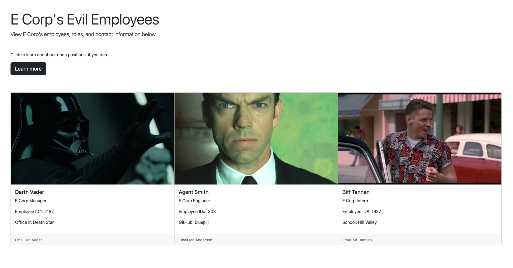

# Team Profile Generator
  ## Description
  This application automatically generates a website for your project team or company.

[This link](https://cammeer.github.io/team-profile-generator/) will take you to my version of the deployed site if an index.html file is currently present.
 
  ## Table of Contents
  * [Installation](#installation)
  * [Usage](#usage)
  * [License](#license)
  * [Contributions](#contributions)
  * [Testing](#testing)
  * [Questions](#questions)
  
  ## Installation
  Installation instructions will be provided when this application has been updated.
  
  ## Usage
  Usage instructions will be provided soon! Here's a link to a video showing basic operation: [Google Drive Link](https://drive.google.com/file/d/1JUgEetmfkSpzqg8rKBoa-uYVZssz9X3w/view)
 
  ## License
 Copyright © 2022 [Caren Merz](https://github.com/cammeer).  
This project is [MIT](https://github.com/cammeer/next-progress-bar/blob/main/LICENSE) licensed.
  
  ## Contributions
  I was the only contributor for this project so far. If you would like to contribute, see my email below.
 
  ## Tech
  * JavaScript
  * Node.js
  * HTML
  * CSS
  * Inquirer npm package
  
  ## Testing
  N/A
  
  ## Any Questions?
  This project was created by me: [cammeer](https://github.com/cammeer)
  
  Contact me with any questions at: [caren@merzhaus.org](caren@merzhaus.org)